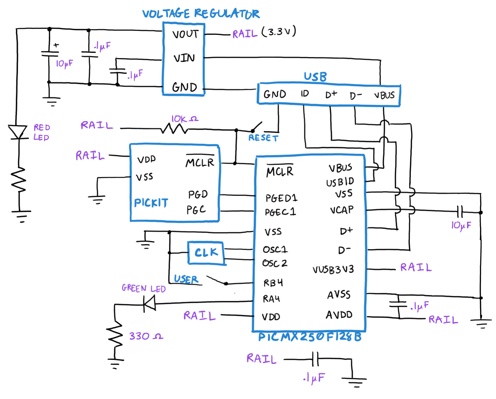

# Homework 1
In HW 1, the first circuit for the PIC was built, incorporating a voltage regulator, two LEDs (one to indicate power and another for use in a program), a reset button, and a USER button for use in a program.

To test the circuit, a simple [program](hw1_code.X/main.c) was written to blink an LED at 1000kHz. While the USER button is pushed, the LED will remain off.
