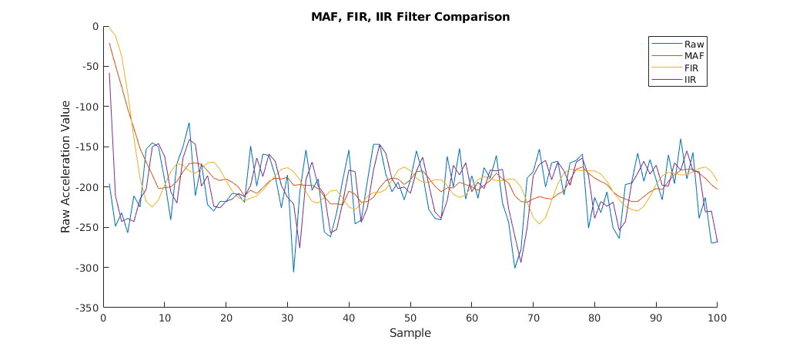
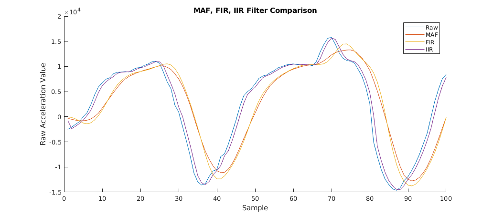

# Homework 10: Digital Signal Processing
This project implements three different filters on the x-axis of IMU acceleration data. Building off of [homework 9](../hw9), the user uses a MATLAB interface to read in the IMU data and display the performance of each filter.

#### Moving Average Filter (MAF)
A moving average filter uses a set of previous data along with the current data sample to output a new sample that is an average of the whole subset. For example, an x-ordered MAF takes the x most recent data samples, sums them up, and then divides that value by x to get the final averaged output. The larger x is, the smoother the output data will be. For this project, an 8th order MAF was used to get approximately a 5Hz cutoff frequency.

#### Finite Impulse Response (FIR) Filter
An FIR filter follows a similar setup as the MAF, but rather than dividing each element in the buffer by the same value (x), each element is divided by a specific weight where all the weights add up to 1. For this project, an 8th order FIR filter with a 5Hz cutoff frequency was used, meaning that there are 9 individual weights and a 9-element buffer.

#### Infinite Impulse Response (IIR) Filter
An IIR filter only uses the two most recent data samples and two weights (which also add up to 1). To compute the final output, the older data sample is multiplied by the first weight and the newer sample is multiplied by the second weight. The two weights can be tuned depending on the application. In cases where older data is much more reliable than a new incoming sample, more weight is typically given to the older sample. If there is good confidence that new data is fairly reliable, more weight is given to the newer sample. For this project, a .70/.30 weight set was used for the old and new samples, respectively.

#### Results

*Top: Data when IMU is at rest. This is essentially a measurement of the sensor's noise. Bottom: Data when the IMU is rotated on its y-axis, creating acceleration along the x-axis.*

Based on the results, the FIR filter seems to perform the best. It does a better job representing the original data than the moving average filter, but it has roughly the same delay (about .03-.04s). The IIR filter has a very small delay of around .01s, but it does not do a great job smoothing out the data compared to the other filters.  
