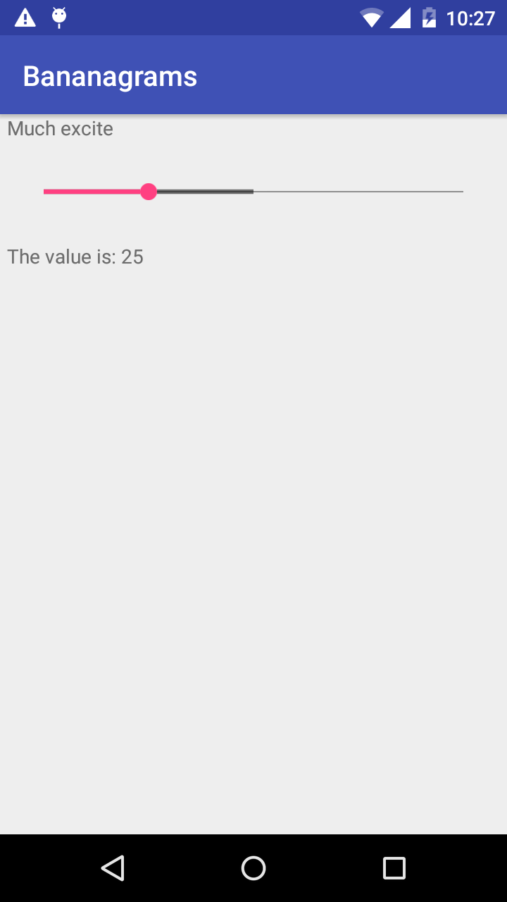

# Homework 12: Intro to Android App Development

This project uses the Moto G android phone running Android 5.1 (Lollipop) for app development. The app itself is very simple - it implements a slider bar and a text box that prints the progress of the slider as the user changes it.

