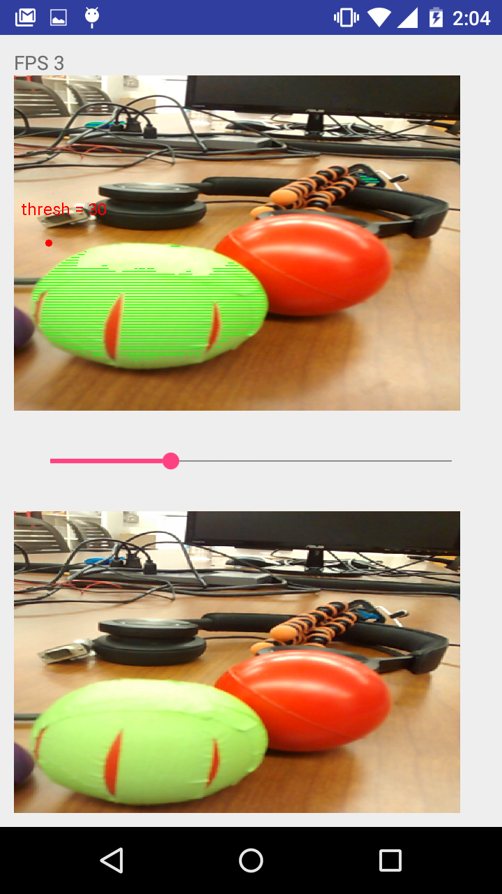

# Homework 13: Accessing the Android Camera

The app from [hw12](hw12) was further developed to access the rear camera on the Moto G. A basic color filter was implemented on the color image which measures the amount of green there is in each pixel. If the amount passes some threshold (decided by a slider), that pixel will be saturated at green and reduce its R and B values to 0. Scanning the entire image takes a long time to process, so the color scanner reads every 4th line of the image to run at a reasonable 3 FPS. The results can be seen in the screenshot below:

