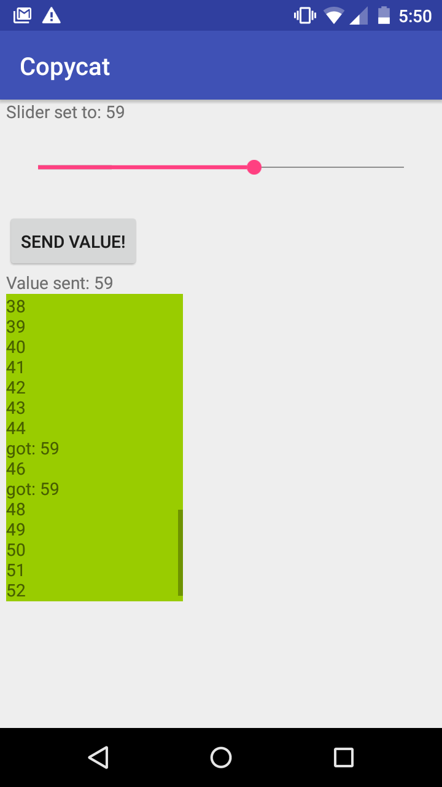

# Android - PIC Communication

This project established USB communication between the PIC and the Moto G. A simple app was made with a slider, a button, and three text views.

When the app is opened, the PIC begins to send a counter value to the phone at a frequency of 5Hz. The android app receives this number and prints it to a scrolling view. To send a number to the PIC, the user moves the slider to first pick the number. The number is sent to the PIC when the button is pressed. When the PIC receives the number, it sends the string "got: x" back to the phone, where x is the number that was sent. The string is then printed to the scroll view.

