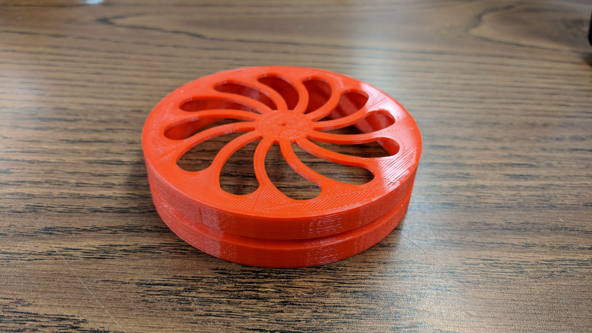

# Homework 15: CAD 3D Printing, and Laser Cutting

This project utilizes Solidworks to create parts to be printed on a 3D printer or cut using a laser cutter. Since the end goal of this course is to create a diff-drive robot, I designed and printed a simple wheel. To get more practice with the laser cutter, I designed a table-top desk that makes use of press-fitting and living hinge designs.

### Wheel

The groove along the rim is designed to hold a 3" rubber O-ring for traction.

### Table-top Desk

Although the living hinge was pretty flexible, those areas were slightly moistened to ensure the wood was pliable enough so that it wouldn't splinter.

