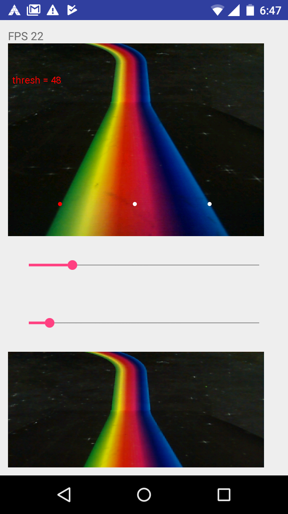

# Homework 17: Path Detection

This project uses the Android Moto G camera to find the center of a rainbow colored line on a black background. The app uses two edge detectors find the left and right bounds of the path. The left-edge detector looks for a large color change from dark to light and the right-edge detector looks for a large color change from light to dark. The black threshold and the sensitivity measure between two pixels are adjustable for different lighting conditions as well. The middle of the path is found by taking the average of the left and right edge locations. Rather than scanning the whole image, the app only scans one line of the image for faster computation. Looking for a large color change seemed more suitable than just finding the color in the middle of the path (which for this case was red) for a couple reasons:
1. The path is a gradient rather than distinct stripes of colors, which would make it more difficult to locate the exact middle of the path. Depending on lighting conditions, the color perceived as red could shift laterally along the path.
2. Distinguishing black from color is more robust to different lighting conditions.

