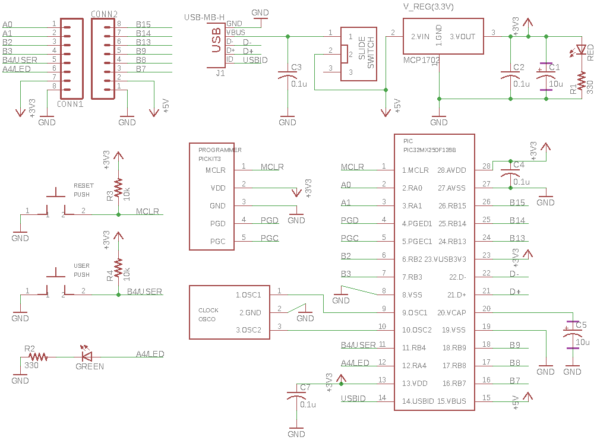
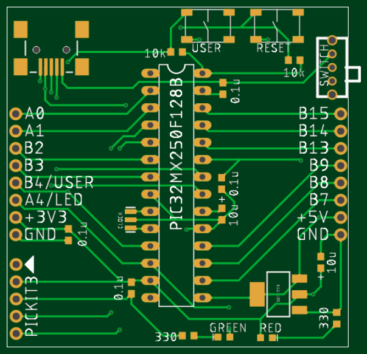
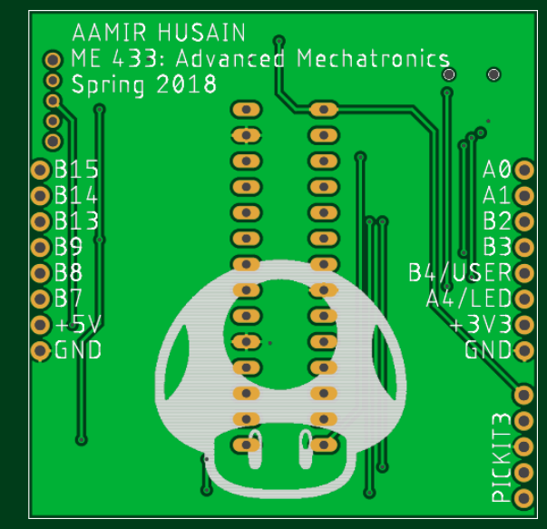

# Homework 2
The schematic for the circuit built in Homework 1 was made in Eagle. Custom parts were made for a few of the components.
The zip gerber files can be found [here](PIC_board/gerber.zip).

