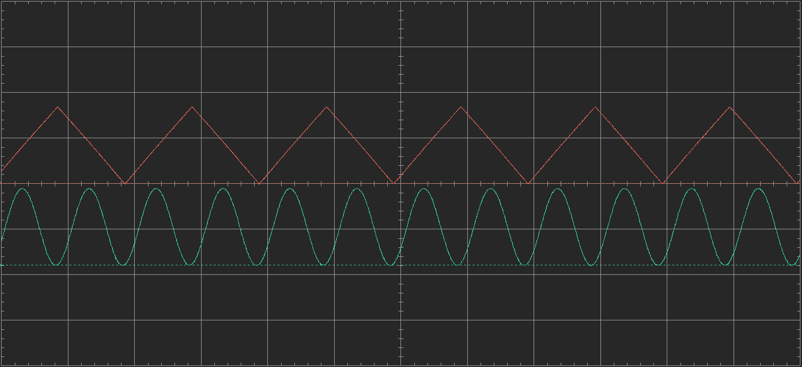

# Homework 4
This assignment introduces the basics of SPI communication to control an output voltage of a digital-to-analog converter (DAC). SPI requires four pins, including ground. **SCK** is the clock controlled by the master device. **SDI** is the data input to the master (a.k.a MISO). **SDO** is the data output from the master (a.k.a MOSI). **SS** is the slave selector which may not always be needed depending on the system. To communicate with the DAC, the SS pin is set to low before sending any data.

The MCP4912 DAC made by Microchip was used for this project. Below is the output of two functions: a 5Hz triangle wave and a 10Hz sin wave. The waves have a resolution of about 3mV - a 10-bit integer is passed to the DAC which uses 3.3V as a reference. To properly communicate with the DAC, data is sent via two 8-bit values. The first value contains four configuration bits for the DAC and the first four bits of the desired output voltage. The second value contains the remaining six bits of the output voltage plus two garbage values that are ignored by the DAC. Once the DAC receives the second bit, it is able to create the desired output voltage.

