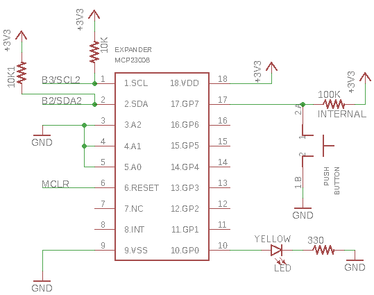

# Homework 5: I2C Pin Expander
This project uses the MCP23008 I/O expander circuit to add a few more pins to the PIC32 since most of them are now used up on the board. A library was written to communicate with the chip via I2C. I2C uses only two pins (plus ground) to communicate, leaving a much smaller footprint compared to SPI. The **SCL** pin is connected to the clock pin of the PIC, and the **SDA** pin is connected to the SDA pin pin of the PIC for data transfer. When communicating, the PIC first sends out the address of the device it wants to talk to. All I2C connected devices get this message, but only the device at the sent address will respond to any future commands sent from the PIC.

When the button on GP7 is pressed, the LED on GP0 turns on. A heartbeat LED constantly blinks to ensure the PIC has not crashed. The button on GP7 has a 100k internal pull-up resistor enabled so it does not short the whole circuit when pressed. The pins on the expander were configured using the IODIR, GPPU, GPIO, and OLAT registers. More information can be found in the [datasheet](http://ww1.microchip.com/downloads/en/DeviceDoc/21919e.pdf).
