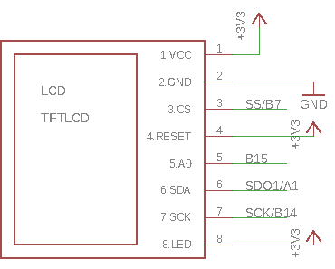

# Homework 6: Controlling and LCD Display
This project introduces the basic concepts of controlling individual pixels of an LCD display. An existing library is used to develop an algorithm that takes an ASCII string as input and then prints the appropriate pixels on a screen. The circuit diagram for hooking up the display is shown below:

#### Algorithm for Printing ASCII Characters
1. `sprintf()` is used to create a string array.
2. The first character of the array is passed to the `LCD_drawChar()` function which finds the appropriate character in an ASCII table. Each value in the table essentially contains a 5x8 pixel bitmap of how the letter should look on the screen.
3. For every "1" found in the bitmap, `LCD_drawPixel()` is called to fill the appropriate pixel on the screen with some given input color `c1`. Any "0" values are filled with an input background color `c2`.
4. This process is repeated for every character in the array until the null character `\0` is reached.
