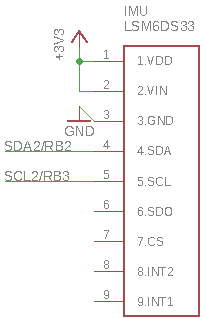

# Homework 7: Reading an IMU
This project uses I2C to communicate with the LSM6DS33 accelerometer and gyroscope. Using code from [homework 5](../hw5) as well as new code to initialize components of the IMU, we are able to read 7 pieces of information: 6 degrees of acceleration (x, y, z, roll, pitch, yaw), and temperature. The x and y acceleration data was printed to the LCD screen from [homework 6](../hw6) as well as a set of perpendicular bars that indicate in what direction the IMU was tilted. The IMU is read at 20Hz and a heartbeat LED runs in the background from the PIC32 to indicate the program is still running normally.

